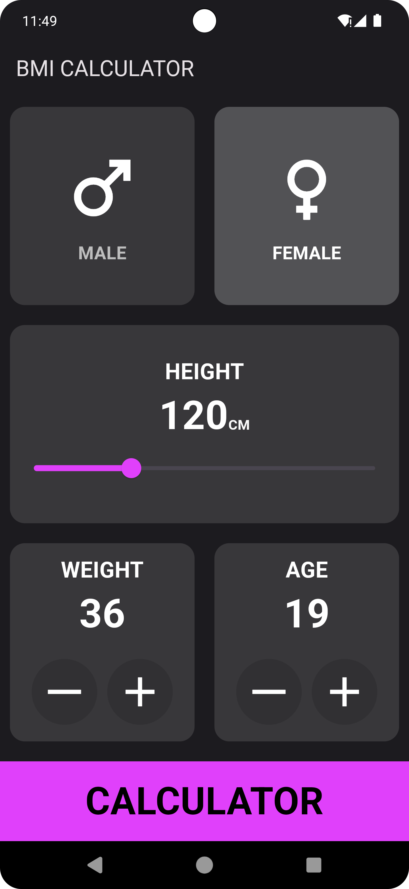
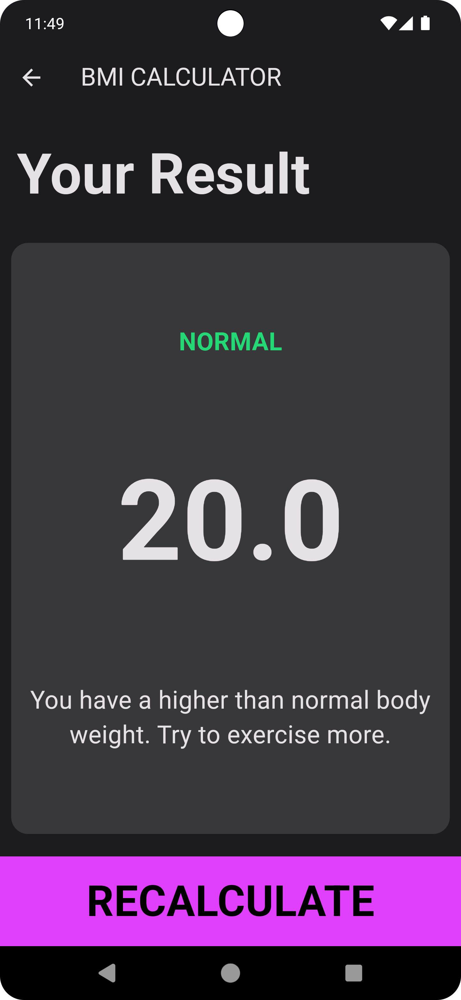

# BMI Calculator App

Welcome to the BMI Calculator App! This Flutter app allows users to calculate their Body Mass Index (BMI) based on their height and weight.

## Features

- **BMI Calculation**: Input age, height and weight to get your BMI.
- **BMI Categories**: Displays categories like Underweight, Normal weight and Overweight.
- **Responsive Design**: Works on various screen sizes and orientations.
- **User-Friendly Interface**: Simple and intuitive design.

## Getting Started

To get this project running on your local machine, follow these steps:

### Prerequisites

1. **Flutter SDK**: Install Flutter from the [Flutter website](https://flutter.dev/docs/get-started/install).
2. **Dart SDK**: Dart comes bundled with Flutter, so if you have Flutter, you have Dart as well.
3. For help getting started with Flutter development, view the
[online documentation](https://docs.flutter.dev/), which offers tutorials,
samples, guidance on mobile development, and a full API reference.

### Installation

1. **Clone the Repository**:

   ```bash
   git clone https://github.com/vinit105/BMI-Calculator.git

   cd bmi_calculator_app

### Project Structure
lib/  
├── components/   
│ ├── [bottom_button.dart](./lib/components/bottom_button.dart)  
│ ├── [circular_icon_button.dart](./lib/components/circular_icon_button.dart)  
│ └── [custom_text.dart](./lib/components/custom_text.dart)  
├── models/  
│ └── [calculate.dart](./lib/model/calculate.dart)  
├── screens/  
│ ├── [home.dart](./lib/screens/home.dart)  
│ └── [result_page.dart](./lib/screens/results_page.dart)  
└── [main.dart](./lib/main.dart)
## Contributing
Contributions are welcome! To contribute:

- Fork the repository.
- Create a new branch (git checkout -b feature/YourFeature).
- Make your changes.
- Commit your changes (git commit -am 'Add some feature').
- Push to the branch (git push origin feature/YourFeature).
- Create a Pull Request.

## Screenshots

<div>
  

</div>  

## Demo 

[](https://github.com/user-attachments/assets/89598c27-7250-4957-b192-6d8c380adf6b)
